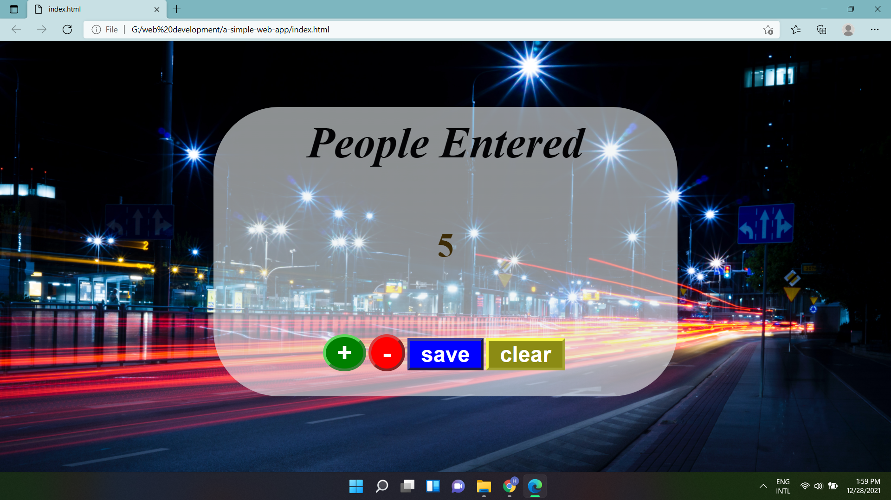

# a-simple-web-app

a simple web application to count the number of people entered to a particular place.

(Technologies used : html ,  css , java script)

</img>

 

<a href='https://wijesooriyahd.github.io/a-simple-web-app/'>click here </a>
